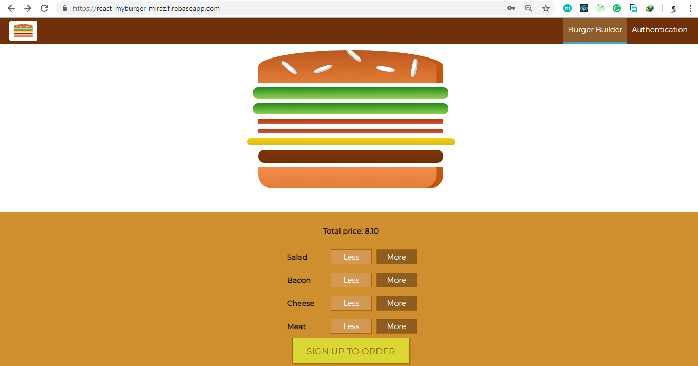

## Myburger

## About

The Myburger  which is an amazing fullstack application utilizing all the React js concepts
and live updating using Firebase  integration. my burger built from scratch. It includes, firebase working signup, login, capabilities;
 Styling of React components
A deep dive into the internals of React and advanced component features
How to access Http content from within React apps,
Redux ... from basics to advanced!
Forms and form validation in React apps
Authentication more

 

## Feature
- `Welcome landind page,`

- `Used material css inital loading`

- `Used switching cool signup and signin systems`

- `When users starting adding ingredients`

- `order step one`

- `Order step two`

- `Validation cool custom Contact Information`

- `Show simple orderlist`

- `It's responsive for all device`

- `firebase database desgin`

## Following technologies are used

 - `React`
 - `Redux` 
 - `Firebase`
 - `axios`
 - `babel-core`
 - `css-loader`
 - `dotenv`
 - `dotenv-expand`
 - `enzyme`
 - `enzyme-adapter-react-16`
 - `eslint`
 - `eslint-config-react-app`
 - `redux-thunk`
 - `webpack-dev-server`
 - `react-redux-toastr`
 - `react-router-dom`
 - `react-test-renderer`
 - `jest`
 - `html-webpack-plugin`
  
 
     

## Supported Browsers

`By default, the generated project supports all modern browsers.`  
   

## Scripts
for starting please make sure that you have config file othwise it's don't working 
- `yarn start` Start server in development environment

                                                                                                                                                                                                                                                                                                                                                                     