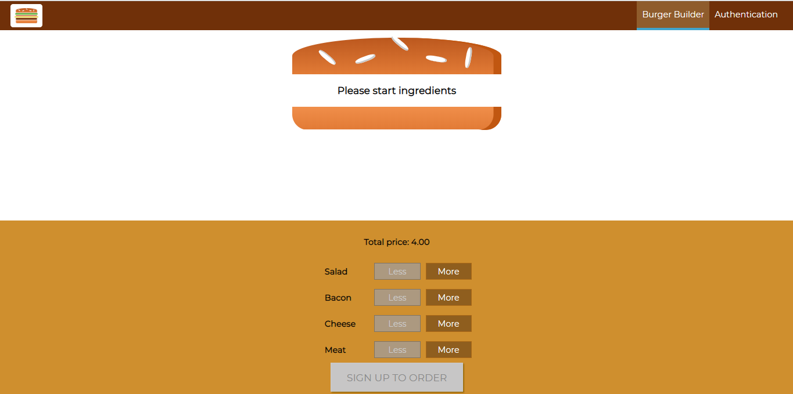
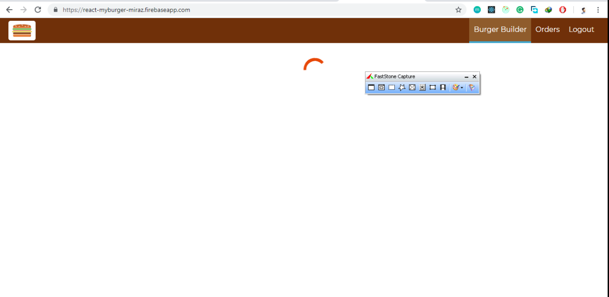
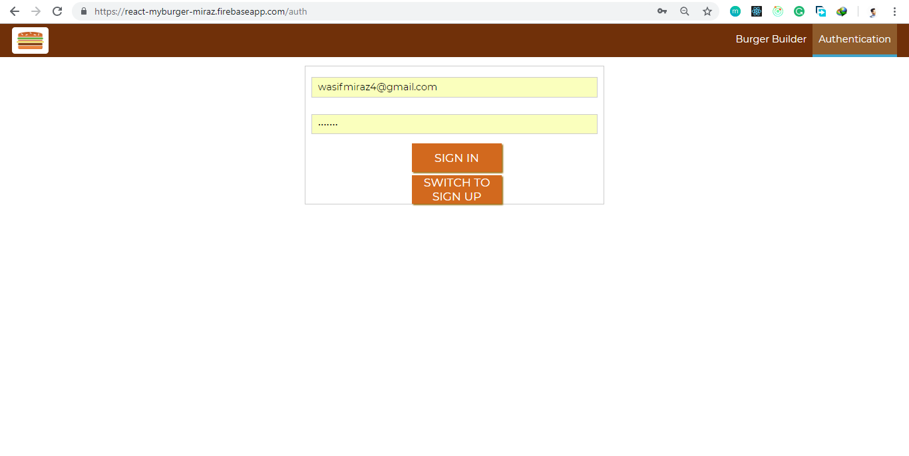
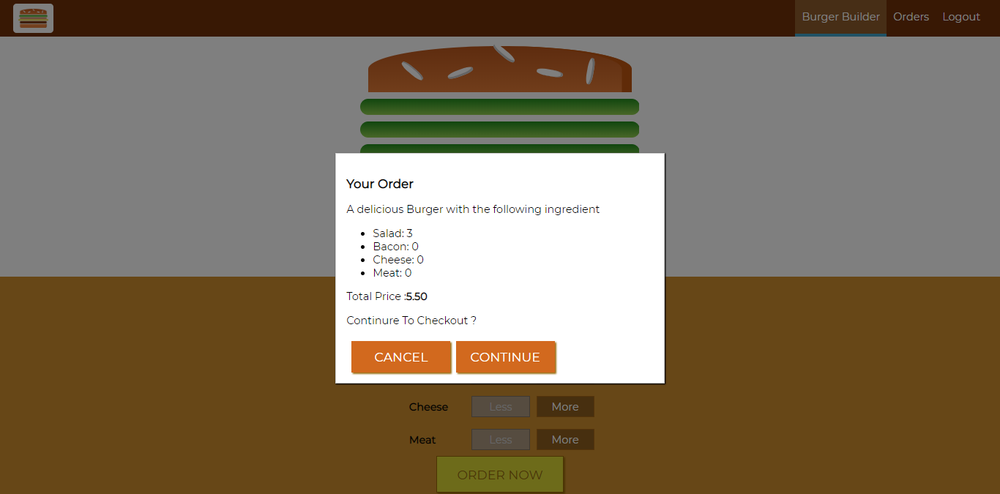
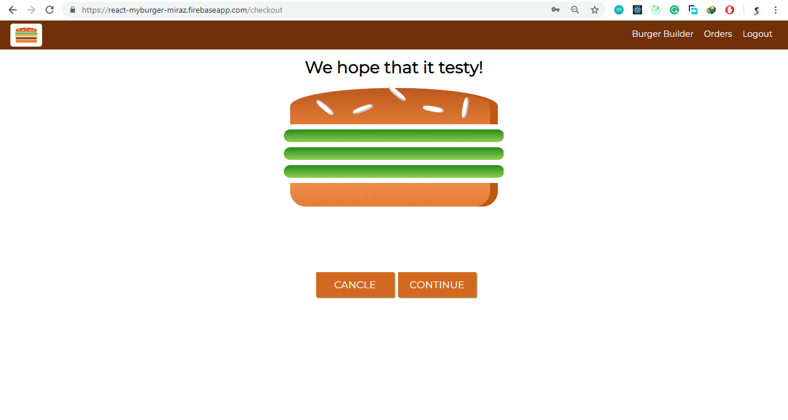
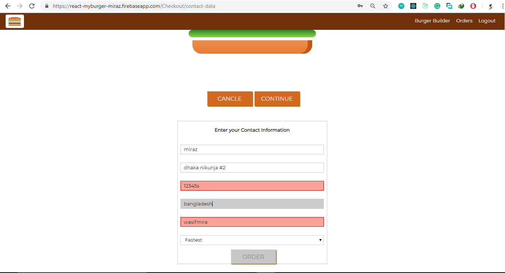
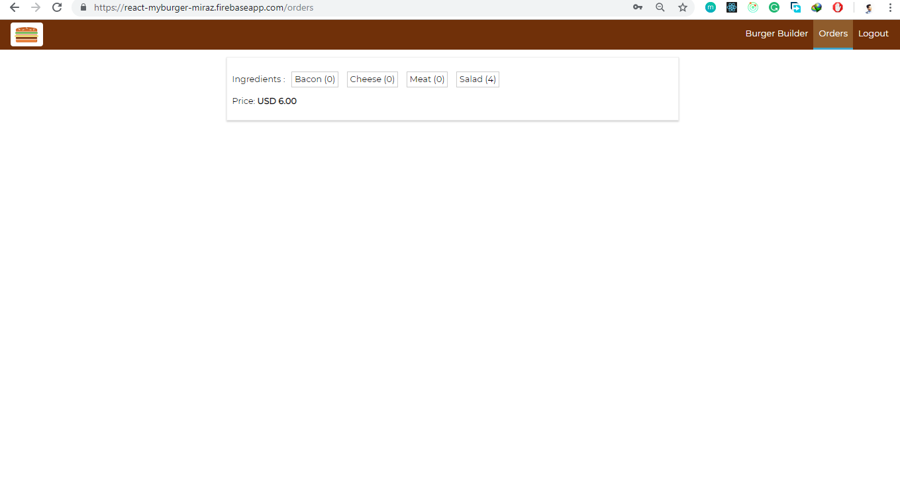
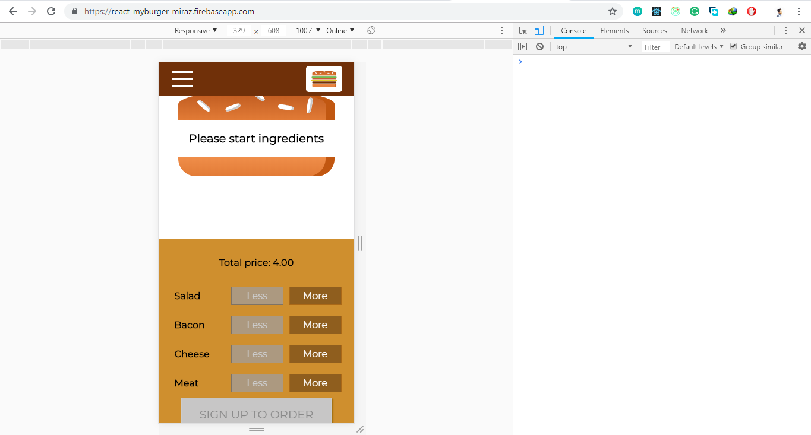
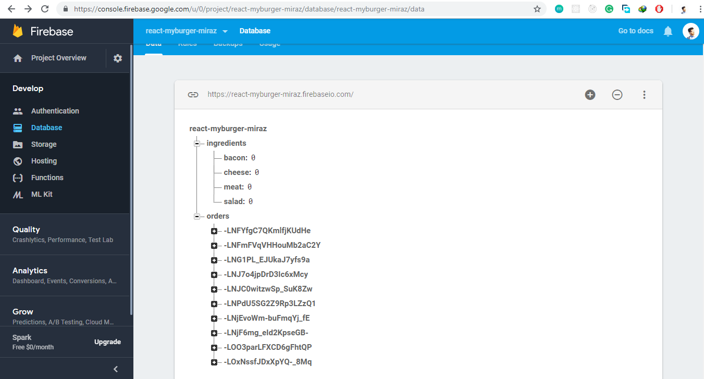

## Fullstack-Blitz

## About

 `this is  my learning based project done 90% work, I always wished I'd had a social network for event publishing to find other event publisher  to collaborate with. It's like Hoffyevent, except instead of dates it's for finding event location to city with and make tracks. View all users, view each user's profile and information,  see similar users in the sidebar. this is also can track users activity`

 

## Feature
- `Welcome landind page,`

- `Used material css inital loading`

- `Used switching cool signup and signin systems`

- `When users starting adding ingredients`

- `Order step two`

- `Validation cool custom Contact Information`

- `Show simple orderlist`

- `It's responsive for all device `

- `firebase database desgin`

## Following technologies are used

 - `React`
 - `Redux` 
 - `Express`
 - `mongoose`
 - `Mlab database`
 - `Nodemoon`
 - `Redux-thunk`
 - `ReduxForm`
 - `Passport js`
 - `Gooogle passport 0auth`
 - `Body-parser`
 - `NPM`
 - `Stripe`
 - `Sendgrid`
 - `Cookie-session`
 - `Concurrently`
  
 
     

## Supported Browsers

`By default, the generated project supports all modern browsers.`  
   

## Scripts
for starting please make sure that you have config file othwise it's don't working 
- `npm run run dev` Start server in production environment

                                                                                                                                                                                                                                                                                                                                                                     